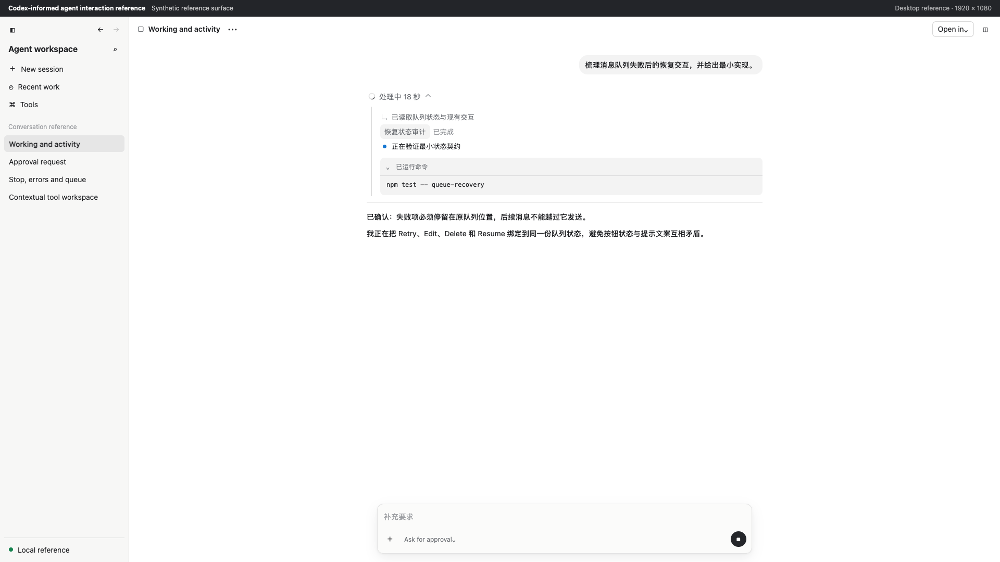
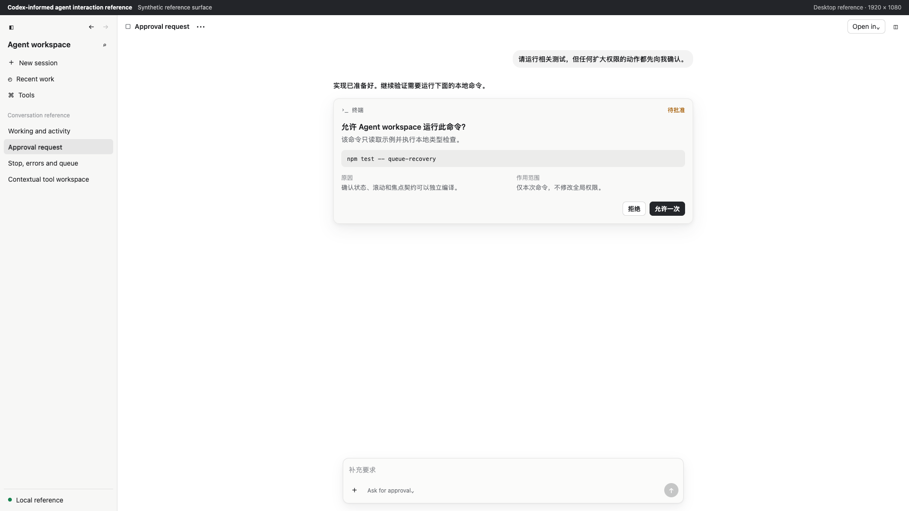
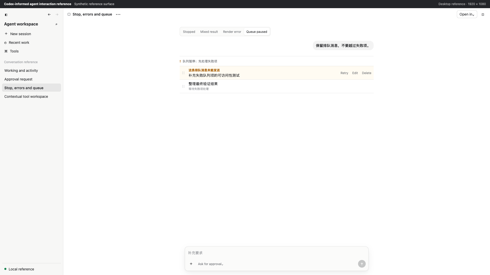
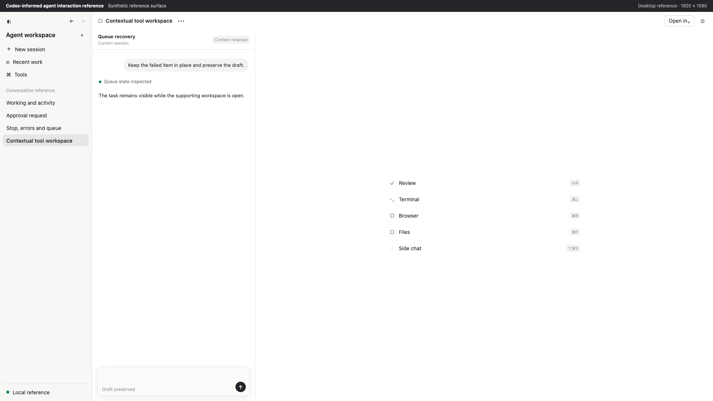
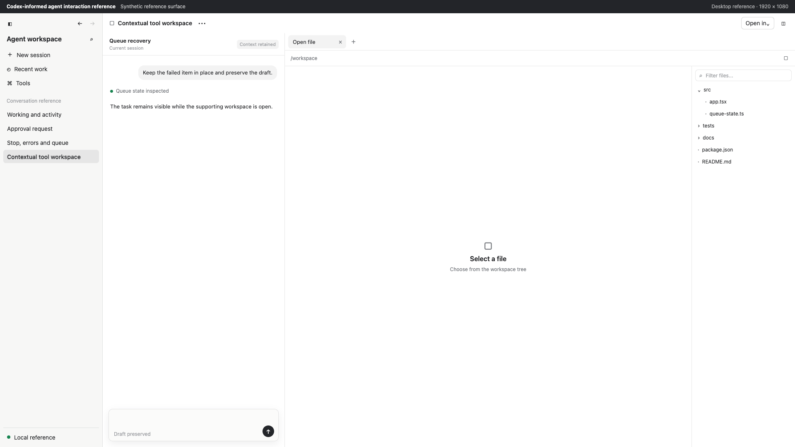

# Agent Product Interaction Guide

This guide covers conversational, long-running, tool-using agent interfaces: task progress, approvals, queues, interruption and recovery, composers, contextual tool workspaces, file trees, scrolling, focus, and accessibility.

## Evidence vocabulary

- `[Design]`: a transferable design recommendation. Unmarked normative guidance also belongs to this category.
- `[Observed]`: a limited interaction observed in a running reference product. It does not imply knowledge of its implementation.
- `[Static]`: a clue found in shipped resources or localized copy. It cannot prove runtime layout or state coexistence.
- `[Synthetic]`: an original example made to explain a contract. It is not a product screenshot or target-project runtime evidence.

## 1. Product model

An agent product is not a conventional chat box. It carries long execution, incremental output, tool calls, permission decisions, interruption, mixed outcomes, and queued follow-ups.

Apply these principles:

1. Keep the primary content column stable and readable. Navigation and tools are secondary.
2. Represent Waiting, Working, Approval, Stopped, Error, Partial success, and Queue paused through one coherent state model.
3. Show scannable activity summaries first and disclose commands, logs, and tool details progressively.
4. Keep approval, failure, retry scope, and queue blockage directly visible.
5. Give the user ownership of scrolling once they leave the follow zone.
6. Preserve completed work, drafts, queued input, and reading position through interruption and recovery.
7. Match visual emphasis to risk. Keep ordinary actions quiet, expose one current primary action, and name the subject and scope of dangerous or permission-expanding actions.

Avoid marketing composition, oversized headings, decorative card walls, and nested cards. Optimize density for scanning, comparison, and repeated work.

## 2. Task workflow

Before implementation, answer:

- Is the user waiting, executing, approving, stopped, failed, or recovering?
- Is the one primary action Send, Stop, Allow, Resume, or Retry?
- What exact object does Retry affect, and can it undo completed work?
- How are scroll position and the visual anchor preserved after expansion or thread switching?
- How can keyboard and touch users reach actions disclosed on hover?
- How will dynamic status be announced without reading every streamed token?

Inspect the host design system before choosing visual tokens. Build a state matrix, define exit conditions, implement the smallest solution, and verify the real page. A synthetic example can guide implementation but cannot replace runtime acceptance.

## 3. Information architecture

```text
App shell
|-- Sidebar or navigation
|-- Main workspace
|   |-- Stable toolbar
|   |-- Thread scroll container
|   |   |-- Conversation turns
|   |   `-- Activity, approval, error, diff, and sources
|   `-- Sticky composer footer
|-- Optional contextual side pane
`-- Optional bottom tool pane
```

Layout invariants:

- Sidebar, toolbar, composer, and fixed tool buttons use stable tracks.
- The thread uses a bounded readable width instead of expanding indefinitely.
- The composer reserves bottom safe area so it cannot cover the final content.
- Resizable panes define minimum, maximum, hit area, reset, and persistence behavior.
- Narrow layouts collapse secondary panes before compressing every region into unusable widths.
- Loading, hover, error, and icon changes cannot shift fixed geometry.

### Contextual tool workspace

`[Observed]` A useful desktop pattern treats the side pane as a contextual tool workspace: a compact launcher leads to tools, while a Files-like view establishes a tab strip, primary canvas, and filterable tree. Transfer the context and pane contracts, not specific labels, shortcuts, or dimensions.

- Preserve recognition of the originating task or thread.
- Keep launcher rows compact with stable icon, label, and optional shortcut slots.
- In an active tool, establish a clear hierarchy among active tab, close action, canvas, secondary tree, and empty state.
- Use dense rows and nearby filtering for trees and resource lists. Do not turn empty work surfaces into hero sections.
- Restore active tabs and pane size by work context; collapse the secondary tree or whole pane at narrow widths.
- Restore a sensible focus target after tool switching, tab closure, and pane closure.
- Build this framework only when multiple real tools require it.

## 4. Thread grammar

```text
Turn
|-- User message
|-- Activity summary and details (optional)
|-- Approval or error (optional and directly visible)
|-- Assistant result
|-- Code, command, diff, or sources (optional)
`-- Object actions and metadata
```

- A restrained, width-limited bubble may distinguish user input. Assistant output normally enters the content flow directly.
- Reserve stable space for Copy, Edit, time, and other actions even when disclosed on hover, focus, or a menu.
- Allow long paths, URLs, and uninterrupted strings to wrap.
- Give every turn and meaningful object a stable anchor.
- Summarize activity in human language and show elapsed time when useful. Group expanded details rather than dumping unlimited logs.
- Stop shimmer and spinners when an activity completes.
- `[Observed]` Object state works well when expressed in the title verb or next to the related object. A generic right-edge `Success` badge weakens alignment and overstates what command completion means.
- Bind exit codes and errors to the command they describe. Keep failure and approval visible when details collapse.
- For code, diffs, and sources, keep controls clear of content, describe changes beyond red/green color, and bind Undo or Retry to a file, hunk, or call.

## 5. State model

| State | Required signal | Primary action | Never do |
| --- | --- | --- | --- |
| Idle | Editable input, current mode, attachments | Send | Explain the entire product in a giant empty state |
| Waiting | Request accepted, no meaningful activity yet | Stop or explicit wait | Show no feedback or impersonate Approval |
| Working | Current activity, incremental results, elapsed time | Stop | Use a full-page spinner or unbounded logs |
| Approval | Subject, reason, risk, and scope | Allow once, with Deny available | Hide it in a toast or activity detail |
| Stopped | Preserved work and halted execution | Resume | Clear the thread, draft, queue, or position |
| Error | Failed object, cause, preserved scope | Object-level Retry, Edit, or Fix | Reset the whole page or use a generic error |
| Success | Stable result with inspectable process and sources | Follow-up or object action | Keep Stop visible or add disruptive celebration |
| Partial success | Successful, failed, and incomplete objects | Inspect failures; retry only when safe | Flatten the outcome into all green or all red |
| Queue paused | Blocker, failed item, later items | Resolve failed item, then Resume | Silently skip the failed item |

Use a discriminated union or equivalent state machine. Independent booleans such as `isLoading`, `hasError`, `needsApproval`, and `canResume` permit contradictory interfaces. See [`conversation-state.contract.ts`](../assets/reference-surface/conversation-state.contract.ts).

## 6. Approval and recovery

An approval is a high-attention decision inside the thread, not an unrelated global notification. Show request type, subject, reason, scope and impact, optional longer-lived choices, Deny, and one primary Allow action.

- Distinguish Waiting and Approval in language, iconography, and action.
- Make `Allow once` the sole primary action. Keep Deny easy to find.
- Name duration and scope for session or persistent permissions.
- Prevent one accidental click from creating a permanent permission expansion.
- Disable conflicting actions while submitting and restore them after failure.

Separate execution failure from local rendering failure. A render retry must not imply backend task re-execution. A destructive Retry must explain what it will undo. Automatic reconnection advances state without masquerading as a user action.

Partial success belongs to a concrete batch, file set, or test group. Lead with failed objects. Offer failed-only retry only when the backend guarantees addressability, idempotency, and preservation of completed work. Otherwise provide a full retry, compensation path, manual repair, or explicit non-retryable outcome.

## 7. Composer and queue

The composer is a persistent control surface:

- Grow smoothly from one line to multiple lines and then internal scrolling.
- Keep attachments, errors, queues, and permission menus clear of the draft.
- Preserve one stable primary-action slot: Send, Stop, or Resume according to state.
- Give icon-only controls an accessible name and tooltip.
- During Approval, place the decision on the approval surface rather than the composer.
- Explain disabled state when context alone is insufficient.

When new input queues behind active work:

- Preserve item order, summary, attachments, and stable identity.
- Expose Edit, Delete, and Retry through hover, focus, menu, and touch paths.
- Preserve position after editing and move focus predictably after deletion.
- Keep the queue paused after Stop until explicit Resume.
- Leave a failed send in place and block later items.
- Name the object affected by Retry, Edit, Delete, and Resume.

## 8. Scrolling and position

The experience contract matters more than whether the implementation uses a normal list, reversed list, or virtualization.

- Treat roughly `24px` from the newest content as a starting follow-zone threshold, then validate it in the local scroll container.
- Follow new content only while the user remains in that zone.
- After upward scrolling, show a return-to-latest control without reclaiming ownership.
- Record a visual anchor before expanding activity, diff, or code, then restore its viewport offset.
- Store position per thread rather than in one global offset.
- Include composer height and fixed spacing in bottom safe area.
- Give loading, error, and empty states stable minimum dimensions.

See [`thread-scroll.contract.ts`](../assets/reference-surface/thread-scroll.contract.ts), which isolates list mechanics behind an adapter while preserving the user-facing contract.

## 9. Focus, keyboard, and accessibility

- Make all buttons, menus, rows, disclosures, and approval actions keyboard reachable.
- Pair hover disclosure with `:focus-within` or an object menu.
- Move focus into a menu or dialog intentionally and restore it to the trigger on close.
- Let Escape dismiss only the top layer before the event reaches the page.
- Focus a safe action in dangerous confirmations. Follow an explicit policy for approval autofocus.
- Do not repair incorrect DOM order with positive `tabindex`.
- Use a suitable live region for dynamic status and avoid announcing every streamed token.
- Programmatically associate errors with their objects.
- Provide keyboard alternatives, cancellation, and outcome announcements for drag and reorder.
- Express diff, warning, error, and success with more than color.
- Test at 200% zoom, with larger system text, long CJK text, and long English words.

See [`focus-lifecycle.contract.ts`](../assets/reference-surface/focus-lifecycle.contract.ts).

## 10. Motion and responsive behavior

- Animate only to explain continuity in disclosure, menus, panes, queue reorder, and loading-to-result transitions.
- Do not animate streaming text character by character.
- Preserve scroll anchors before preserving decorative motion.
- Under `prefers-reduced-motion`, remove unnecessary displacement, springs, and fades while keeping state signals.
- At the narrowest supported width, collapse secondary panes before compromising the main content and approval actions.
- Give fixed-format controls explicit tracks, minimums, maximums, or aspect ratios so text changes do not shift layout.

## 11. Synthetic reference surface

The dependency-free reference surface in [`assets/reference-surface/`](../assets/reference-surface/) is an original implementation for studying contracts. Do not ship it as a product page.

| Asset | Inspect |
| --- | --- |
| [`conversation-state.contract.ts`](../assets/reference-surface/conversation-state.contract.ts) | State, visible signal, primary action, and scoped retry from one source |
| [`thread-scroll.contract.ts`](../assets/reference-surface/thread-scroll.contract.ts) | Follow zone, anchor, per-thread position, composer safe area |
| [`focus-lifecycle.contract.ts`](../assets/reference-surface/focus-lifecycle.contract.ts) | Escape layers, focus restore, safe initial focus, accessible names |
| [`tool-workspace.contract.ts`](../assets/reference-surface/tool-workspace.contract.ts) | Closed/launcher/active state, tabs, pane width, secondary navigation |
| [`index.html`](../assets/reference-surface/index.html) | Working, Approval, recovery, queue, launcher, and Files scenarios |



Annotated: [`01-working-activity-annotated.png`](../assets/screenshots/01-working-activity-annotated.png)



Annotated: [`02-approval-annotated.png`](../assets/screenshots/02-approval-annotated.png)



Annotated: [`03-stop-error-queue-annotated.png`](../assets/screenshots/03-stop-error-queue-annotated.png)



Annotated: [`04-tool-workspace-launcher-annotated.png`](../assets/screenshots/04-tool-workspace-launcher-annotated.png)



Annotated: [`05-tool-workspace-files-annotated.png`](../assets/screenshots/05-tool-workspace-files-annotated.png)

Annotated element labels are automation overlays tied to one captured DOM snapshot. They are evidence aids, not product styling, and their element references expire after the page changes.

## 12. Acceptance checklist

### Layout

- [ ] Primary path verified at the target desktop width and narrowest supported width.
- [ ] Sidebar, toolbar, composer, and action slots remain stable as copy changes.
- [ ] Sticky surfaces never cover first or last content; long paths and text wrap.
- [ ] Tool launcher, tabs, canvas, and secondary tree have a clear hierarchy and restore focus.
- [ ] No nested cards, section-as-card composition, or purposeless decoration.

### State and recovery

- [ ] Waiting and Approval differ in copy, visual signal, and action.
- [ ] Working can Stop; Stopped preserves work, draft, queue, and position.
- [ ] Error names the object, cause, impact, and recovery action.
- [ ] Retry names its object and any rollback.
- [ ] Partial success exposes successful and failed scope together.
- [ ] Queue failure never silently skips a message.
- [ ] Activity becomes secondary after a stable result appears.

### Interaction and accessibility

- [ ] The primary path works with keyboard only and focus is visible.
- [ ] Layer closure restores focus and Escape follows layer order.
- [ ] Hover actions have keyboard and touch paths.
- [ ] Dynamic status does not overwhelm assistive technology.
- [ ] Light and dark themes, 200% zoom, and reduced motion were checked.
- [ ] Drag and reorder offer cancellation, failure recovery, and keyboard alternatives.

### Evidence

- [ ] Synthetic references are labeled and separated from real runtime evidence.
- [ ] Runtime claims name the tested page, viewport, states, and limitations.
- [ ] No private screenshot, user data, credential, local path, or proprietary asset enters public output.
